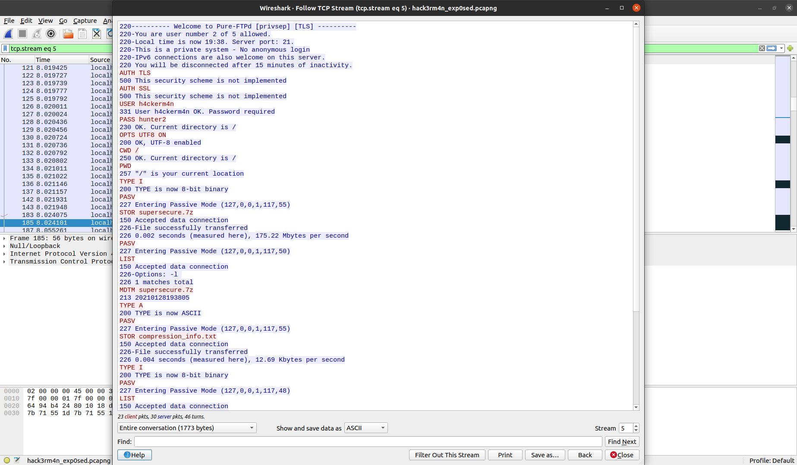
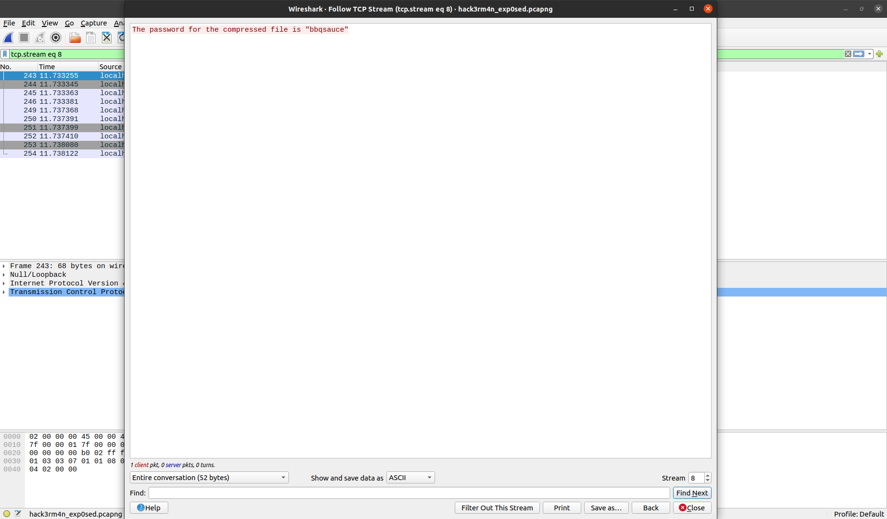
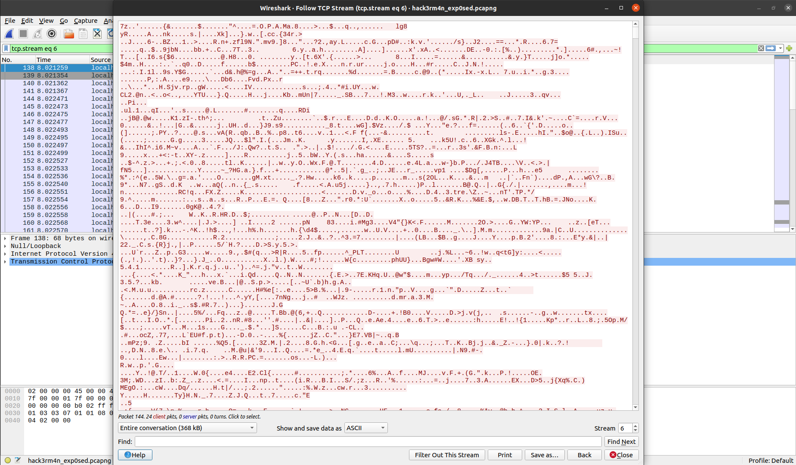
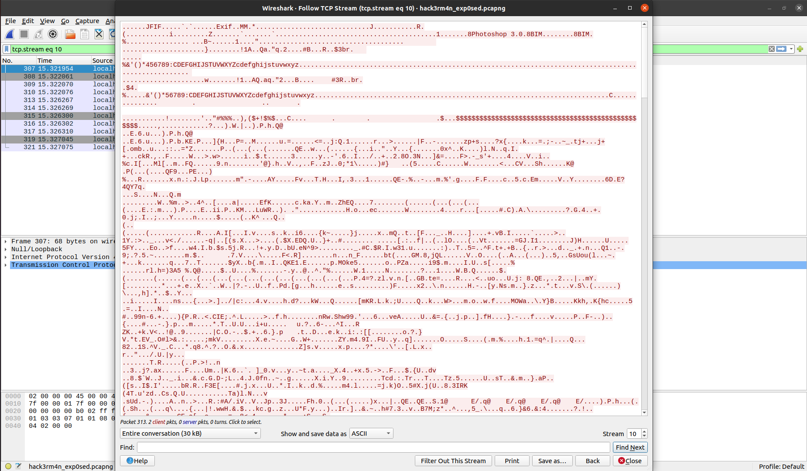
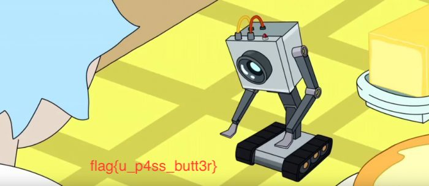
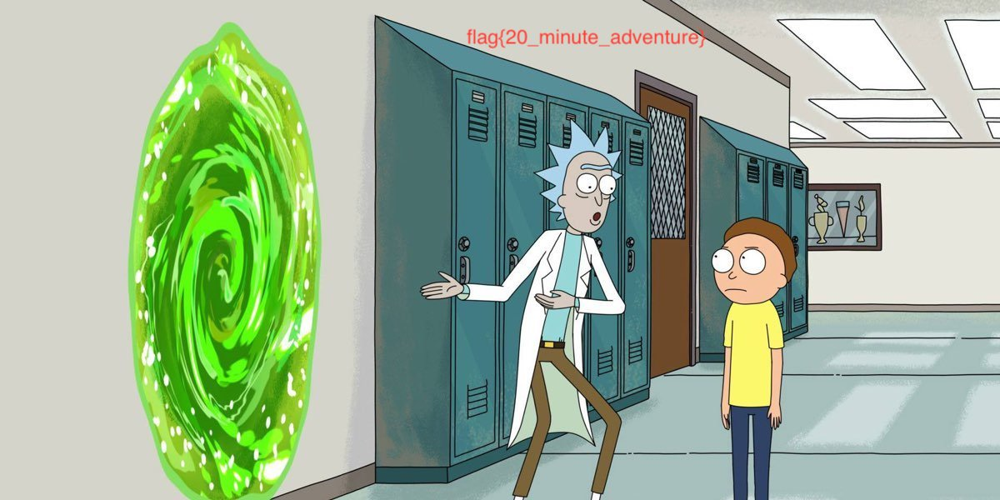

# Tenable CTF

## Forensics

### **H4ck3R_m4n exp0sed! 1**
For this challenge we needed to open the given file with Wireshark since it was a packet capture.

In Wireshark there is a tool to follow a TCP stream. With that, we found some interesting stuff:

This first stream shows a TCP communication. Going through the rest of the TCP streams we found even more interesting things:

This stream is a file with some text in it which is some kind of password. Looking to the other streams we found two more interesting:

These streams contain file information. Good thing is that you can download this information from Wireshark. For this to work, we needed to download the information as raw bytes. Downloading both files and running the command `file` we know that one of them is an image and the other one is a zip file.

Opening up the image we get this:

> flag{u_p4ss_butt3r}

---

### **H4ck3R_m4n exp0sed! 2**
After the first part we were left with a zip file.

Running the command `7z x file2` to extract the zip it prompted us to input a password. We already had seen this password in Wireshark, it was `bbqsauce`. Extracting the files from the zip we get two more files.

One of them is an image and the other one is a text file. Opening up the image we get:

> flag{pickl3_NIIICK}

---

### **H4ck3R_m4n exp0sed! 3**
For this last challenge we had one more file left. Trying to open this file in a text editor crashed the text editor which meant this was a very large file. Using `cat` to get the file content we get to see that the information is in hex.

USing the tools provided by CyberChef, we uploaded the file and applied the `From Hex` operation. This returned a very large base64 string. With this, we applied the `From Base64` operation which returned a JFIF image. 

Downloading the image and opening it we get:

> flag{20_minute_adventure}

---