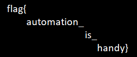

# Tenable CTF

## Web

### **Stay Away Creepy Crawlers**
A robots.txt file tells search engine crawlers which pages or files the crawler can or can't request from your site. This is used mainly to avoid overloading your site with requests. With that in mind, this challenge was about accessing this file. 
Connecting to `http://167.71.246.232:8080/robots.txt` the following text was presented:
```
User-agent: *
Disallow: /admin/
# flag{mr_roboto}
```
> flag{mr_roboto}

---

### **Source of all evil**
To get the flag for this challenge we only needed to see the source code on the website which had an html comment with the flag.
> flag{best_implants_ever}

---

### **Can't find it**
As the name suggests, when connecting to a page that did not exist, the 404 error returned the flag as a message.
> flag{404_oh_no}

---

### **Show me what you got**
The challenge text said something about indexes. That said, we searched for folders in the directory. The folder `images` was found, and when accessing it there was the `aljdi3sd.txt` file wich had the flag inside.
> flag{disable_directory_indexes}

---

### **Certificate of Authenticity**
Talking about authenticity, the first thing that comes to mind is `https`. Trying to access the page with `https` it showed a warning that the connection was not private. In that warning there was a link to see the certificate (in FIrefox) which had the flag in it.
> flag{selfsignedcert}

---

### **Headers for you inspiration**
All we had to do was to check the headers when the page is loaded (refreshing the page with the `Network` tab opened).
> flag{headersftw}

---

### **Ripper Doc**
For this challenge, we needed to click the link `Certified Ripper Docs` which took us to a page that said that we needed to be in the club to get the list.

This reminds something of having permissions, some kind of true/false variable. After opening up the Cookies tab, we found a cookie named `Authenticated` which was set to false. Setting this to true and refreshing the page would give us the flag.
> flag{messing_with_cookies}

---

### **Follow The Rabbit Hole**
For this challenge, we needed to click the link `Rabit Hole` which took us to a page that with the following content:
```
[513, '71'] 4O48APmBiNJhZBfTWMzD
```
The first thing that we saw was that second variable, which seemed like an hexadecimal value.

Watching the URL we also noticed that it had a `page` argument (`http://167.71.246.232:8080/rabbit_hole.php?page=cE4g5bWZtYCuovEgYSO1`) with similar size as one of the information that this page had. 

Trying to change the `page` argument to `4O48APmBiNJhZBfTWMzD` we get another similar page but with different information:
```
[803, 'A5'] dUfob5k9t2vH1dVEU9bU
```

This sounds, together with the challenge name, sounds like we need to keep following these pages and getting these values from them. As we didn't knew how many pages it would take, we made a python script:

```python
import requests

f = open("info.txt", "a")

URL = "http://167.71.246.232:8080/rabbit_hole.php"

PARAMS = {'page':"cE4g5bWZtYCuovEgYSO1"} 

r = requests.get(url = URL, params = PARAMS) 

while r.status_code == 200:
    data = r.text.split('\n ')
    f.write(data[0] + '\n')

    PARAMS = {'page':data[1]} 
    r = requests.get(url = URL, params = PARAMS) 
```

After 1582 pages (thank god I didn't do this by hand) we finally reached the end. Looking at the information from these pages, we realized that each page had a different first number, like an index so we built another python script to order them and write the hex value that they pointed to in a file.

```python
import collections

f = open("file.txt", "r")
f1 = open("flag.bin", "wb")

Lines = f.readlines()

dict = {}

for line in Lines:
    line = line[1:-3].split(', \'')
    dict[int(line[0])] = line[1]

od = collections.OrderedDict(sorted(dict.items()))

for k, v in od.items():
    f1.write(bytes.fromhex(v))
```

At first we tried to just write the hex value as a char, but after some failed tries we realized that we needed to put the raw value. Checking the file type we realized it was a PNG. Opening this image we get:




> flag{automaton_is_handy}